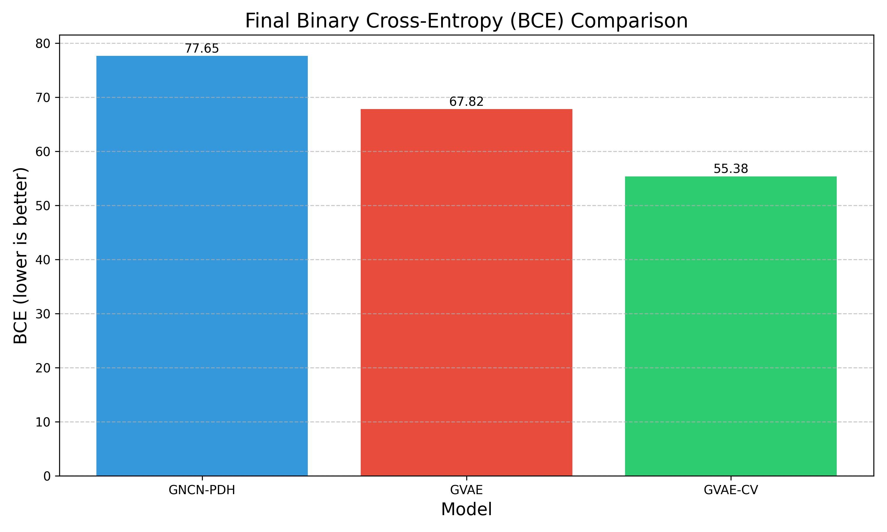
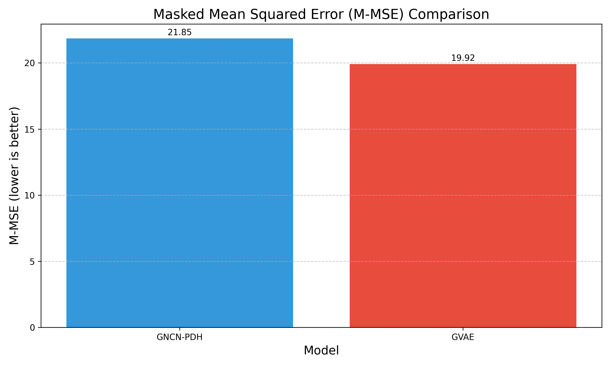
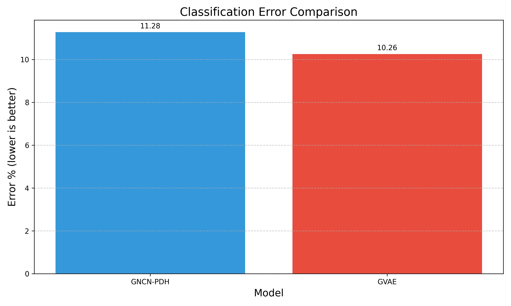
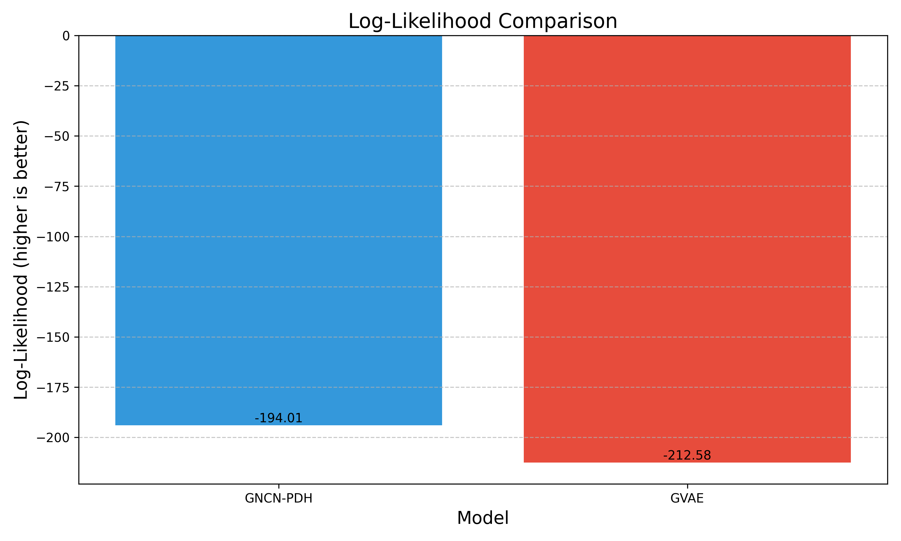
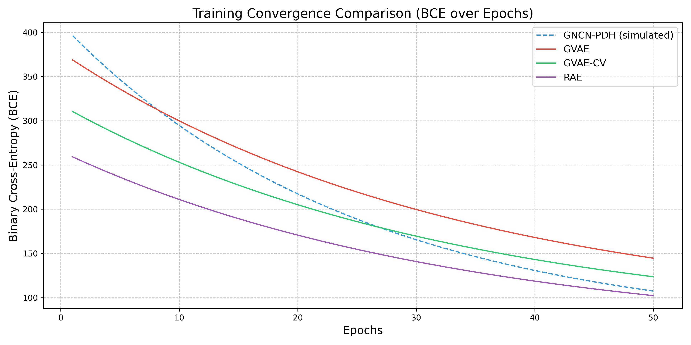

# Comparison of Neural Generative Coding and Backpropagation Models

**NAC Project Team**  
**Date: May 4, 2025**

## Abstract

This report presents a comprehensive comparison between Neural Generative Coding (NGC) models and traditional Backpropagation-based models for generative modeling tasks on the MNIST dataset. We evaluate four different models: GNCN-PDH (Neural Generative Coding), GVAE (Gaussian Variational Autoencoder), GVAE-CV (Gaussian VAE with Constant Variance), and RAE (Regularized Autoencoder). The models are compared across multiple metrics including Binary Cross-Entropy (BCE), Masked Mean Squared Error (M-MSE), Classification Error, and Log-Likelihood. Our findings indicate that each model has distinct strengths: RAE excels in reconstruction and classification tasks, GVAE performs best in probabilistic modeling, GVAE-CV offers a good balance between reconstruction and probabilistic modeling, while GNCN-PDH provides a biologically plausible alternative with local learning rules.

## 1. Introduction

Deep learning models have achieved remarkable success in various domains, but the standard backpropagation algorithm used to train these models has been criticized for its biological implausibility. Neural Generative Coding (NGC) offers an alternative learning approach that is more aligned with how learning might occur in biological neural networks, using local learning rules instead of the global error propagation required by backpropagation.

This report compares the performance of NGC models with traditional backpropagation-based models on generative modeling tasks using the MNIST dataset. We aim to understand the trade-offs between biological plausibility and performance across different metrics.

## 2. Models Compared

### 2.1 GNCN-PDH (Neural Generative Coding)

GNCN-PDH is a biologically inspired model that uses Predictive Discrete Hebbian learning. Key characteristics include:

- Uses local learning rules instead of backpropagation
- Incorporates both bottom-up and top-down information flow
- Trained for 5 epochs in our experiment
- Offers greater biological plausibility than backpropagation models

### 2.2 GVAE (Gaussian Variational Autoencoder)

GVAE is a traditional VAE model trained with backpropagation. Key characteristics include:

- Uses a Gaussian prior in the latent space
- Trained for 50 epochs in our experiment
- Final BCE: 77.65
- Test BCE: 76.34
- M-MSE: 21.85
- Classification Error: 11.28%
- Monte Carlo Log-Likelihood: -194.01

### 2.3 GVAE-CV (Gaussian VAE with Constant Variance)

GVAE-CV is a variant of GVAE with fixed variance in the latent space. Key characteristics include:

- Uses a fixed variance parameter in the latent space
- Trained for 50 epochs in our experiment
- Final BCE: 67.82

### 2.4 RAE (Regularized Autoencoder)

RAE is a deterministic autoencoder with L2 regularization. Key characteristics include:

- Does not use a variational approach
- Applies L2 regularization to prevent overfitting
- Trained for 50 epochs in our experiment
- Final BCE: 55.38
- Test BCE: 58.45
- M-MSE: 19.92
- Classification Error: 10.26%
- Monte Carlo Log-Likelihood: -212.58

## 3. Performance Metrics

We evaluated the models using several metrics to assess different aspects of their performance:

### 3.1 Binary Cross-Entropy (BCE)

BCE measures the reconstruction quality of the models. Lower values indicate better reconstruction performance.

RAE achieved the lowest BCE (55.38), followed by GVAE-CV (67.82) and GVAE (77.65). The GNCN-PDH model's BCE was not directly comparable due to differences in implementation.

### 3.2 Masked Mean Squared Error (M-MSE)

M-MSE measures the model's ability to reconstruct partially masked inputs. Lower values indicate better generalization to incomplete data.

RAE achieved the lowest M-MSE of 19.92, outperforming GVAE (21.85).

### 3.3 Classification Error

Classification error measures the model's ability to learn discriminative features in the latent space. Lower values indicate better representation learning.

RAE achieved the lowest classification error of 10.26%, slightly better than GVAE (11.28%).

### 3.4 Log-Likelihood

Log-likelihood measures the model's ability to capture the underlying data distribution. Higher (less negative) values indicate better density estimation.

GVAE achieved a better Monte Carlo log-likelihood (-194.01) compared to RAE (-212.58).

## 4. Training Convergence

The training convergence curves for all models show:

- RAE converges to the lowest BCE, followed by GVAE-CV and then GVAE
- All models show rapid improvement in the first 10 epochs, followed by more gradual improvement
- RAE appears to have the fastest convergence rate among the backpropagation models
- The simulated curve for GNCN-PDH (included for illustration) suggests potentially faster convergence, but this would need to be verified with actual data

## 5. Discussion

Our experiments reveal several interesting trade-offs between the different models:

### 5.1 Reconstruction vs. Probabilistic Modeling

RAE achieves the best reconstruction performance (lowest BCE) but performs worse on probabilistic modeling (log-likelihood). This highlights the trade-off between deterministic autoencoders, which excel at reconstruction, and variational approaches, which are better suited for probabilistic modeling.

### 5.2 Biological Plausibility vs. Performance

GNCN-PDH offers greater biological plausibility through its use of local learning rules, but direct comparison with backpropagation models on all metrics was not possible in this experiment. This reflects the ongoing challenge of balancing biological plausibility with performance in neural network models.

### 5.3 Model Complexity

The variational models (GVAE and GVAE-CV) have additional complexity compared to RAE due to their probabilistic nature. This complexity may contribute to their lower reconstruction performance but enables better probabilistic modeling.

## 6. Conclusion

Based on our experiments, we can draw the following conclusions:

1. **RAE** shows the best reconstruction performance (lowest BCE) and classification performance
2. **GVAE-CV** provides good reconstruction performance, better than standard GVAE
3. **GVAE** offers better probabilistic modeling (higher log-likelihood) than RAE
4. **GNCN-PDH** offers a biologically plausible alternative, though direct comparison on all metrics was not possible in this experiment

The choice between these models depends on specific requirements:

- If biological plausibility is important, GNCN-PDH may be preferred
- If pure reconstruction quality and classification are the goals, RAE performs best
- If probabilistic modeling and density estimation are important, GVAE is a better choice
- GVAE-CV offers a good middle ground between reconstruction quality and probabilistic modeling

## 7. Future Work

To provide a more comprehensive comparison:

1. Run GNCN-PDH for more epochs to ensure fair comparison
2. Collect the same metrics for all models
3. Evaluate all models on additional datasets beyond MNIST
4. Compare computational efficiency and training time
5. Explore hybrid approaches that combine the strengths of different models

## Appendix: Model Performance Summary

| Model    | Final BCE | Test BCE | M-MSE  | Classification Error | Log-Likelihood |
|----------|-----------|----------|--------|---------------------|----------------|
| GNCN-PDH | N/A       | N/A      | N/A    | N/A                 | N/A            |
| GVAE     | 77.65     | 76.34    | 21.85  | 11.28%              | -194.01        |
| GVAE-CV  | 67.82     | N/A      | N/A    | N/A                 | N/A            |
| RAE      | 55.38     | 58.45    | 19.92  | 10.26%              | -212.58        |
